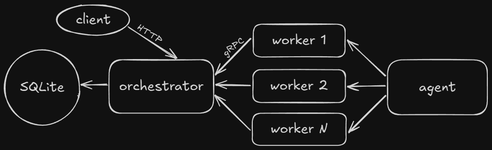

# Calc Service: Итоговый проект по годовому курсу Яндекс Лицея "Программирование на Go" | 24 
 #### Проверяющему, 
##### Если при проверке решения, найдете недочет или серьезную ошибку, пожалуйста сообщите мне в `Issues` на github, или в телеграм `@artrubadur`, чтобы я мог их исправить. Я надеюсь на ваше снисхождение и понимание.
Если автор - не OinkiePie, то проект украден.
## Описание

Calc Service - это распределенная система, предназначенная для вычисления сложных математических выражений. Она состоит из следующих компонентов:

*   **Orchestrator:** Координирует процесс вычисления, разбивая сложные выражения на простые задачи и распределяя их между агентами.
*   **Agent:** Выполняет отдельные математические задачи, полученные от оркестратора, и возвращает результаты.

## Оглавление
1. Архитектура - файловая система
2. Конфигурация - создание и применение
3. Сборка и запуск - классическая сборка, сборка с Docker или Docker Compose
4. Принцип работы - описание работы и примеры

    * Архитектура и компоненты 
    * Workflow
    * Использование

5. Тестирование - модульные и интеграционные
6. Логгирование - логгер и его настройка
## Архитектура
```
calc_3/		    // github.com/OinkiePie/calc_3
│
├───agent
│   ├───cmd         // Точка входа Агента.
│   └───internal
│       └───workers // Рабочий выполняющий задачи
│
├───config          // Загружает и обрабатывает конфигурации
│   └───configs     // Файлы конфигурации. Выбираются APP_ENV
├───orchestrator
│   ├───cmd                             // Точка входа Оркестратора.                   
│   └───internal
│       ├───grpcservice                 // Обрабатывает gRPC запросы Оркестратору
│       ├───handlers                    // Обрабатывает HTTP запросы Оркестратору
│       ├───managers                    // Менеджеры для сложных операций
│       │   ├───expressions_manager     // - Все связанное с выражениями
│       │   └───user_manager            // - Все связанное с пользователями
│       ├───middlewares                 // Предбработчики HTTP запросов Окестратору
│       ├───providers                   // Собирает и предоставляет БД, репозитории и менеджеры
│       ├───repositories                // Репозитории для низкоуровнего взаимодействия с БД
│       │   ├───expressions_repository  // - Выражения
│       │   ├───session_repository      // - Сессии
│       │   ├───tasks_repository        // - Задачи, их аргументы и зависимости
│       │   └───user_repository         // - Пользователи
│       ├───router                      // Маршруты Окестратора
│       └───task_splitter               // Разбивает выражение на задачи
│
└───pkg
    ├───database    // Создает и настраивает БД  
    ├───initializer // Инициализирует логгер и конфигурацию
    ├───jwt_manager // Взаимодействует с JWT токенами
    ├───logger      // Логирует сообщения.
    ├───models      // Структуры данных
    ├───operators   // Символы математических операций
    ├───proto       // .proto и созданные им файлы 
    └───shutdown    // Завершает сервис
```

## Конфигурация

### Создание конфигурации
Основные параметры конфигурации находятся в файле `config/configs/<name>.yml`.
При установке проекта будут уже доступны 2 варианта запуска: dev *(мгновенное выполнение)* и prod *(задержки вычислений)*.
Вы можете создать свой файл конфигурации в этой же папке *(не забудьте убрать переменные окружения, иначе они перезапишут его)*.

Выбрать файл конфигурации можно переменной окружения APP_CFG (`APP_CFG=config/configs/dev.yml`, разрешены расширения `yaml` и `yml`). Если указать значение `CFG_FALSE` файл конфигурации не будет применен.
Вы можете изменить её в файле `.env`. 
В зависимости от терминала вы можете перезаписать её следующим образом:

(Только для текущей сессии командной строки)
```shell
$env:APP_CFG="<name>"
```
```bash
set APP_CFG="<name>"
```

Или указать при запуске Docker (флаг -e):
```bash
docker run -d --network mynet \
    -p 8080:8080 -p 50051:50051 \
    --name orchestrator \
    -e ORCHESTRATOR_GRPC_ADDR=0.0.0.0 \
    -e APP_CFG=<путь> \
    orchestrator:latest
```
### Что делают параметры ENV?
```
APP_CFG=config/configs/dev.yml // Адрес файла конфигурации, можеть быть CFG_FALSE

SECRET_KEY=secret   // Секретный ключ для генерации JWT токенов
TOKEN_TTL_MIN=10    // Время жизни JWT токена
SESSION_CLEAR_MIN=1 // Интервал очисток истекших сессий

DATABASE=calc.db             // Путь к базе данных
ORCHESTRATOR_ADDR=127.0.0.1  // Адрес оркестратора
ORCHESTRATOR_HTTP_PORT=8080  // Порт HTTP сервера оркестратора
ORCHESTRATOR_GRPC_PORT=50051 // Порт gRPC сервера оркестратора

AGENT_REPEAT=2000     // Интервал между запросами агента
AGENT_REPEAT_ERR=5000 // Интервал между запросами агента в случае ошибки
COMPUTING_POWER=1     // Количество воркеров агента

// Время выполнения математических операций
TIME_ADDITION_MS=0       // Сложение
TIME_SUBTRACTION_MS=0    // Вычитание
TIME_MULTIPLICATION_MS=0 // Умножение
TIME_DIVISION_MS=0       // Деление
TIME_UNARY_MINUS_MS=0    // Унарный минус
TIME_POWER_MS=0          // Возведение в степень
```
### Что делают параметры файла конфигурации yml?
```yml
services:
  orchestrator:
    # Аналогично ENV
    ORCHESTRATOR_ADDR: '127.0.0.1'
    ORCHESTRATOR_HTTP_PORT: 8080
    ORCHESTRATOR_GRPC_PORT: 50051
    DATABASE: 'calc.db'
  agent:
    # Аналогично ENV
    COMPUTING_POWER: 1
    AGENT_REPEAT: 5000
    AGENT_REPEAT_ERR: 2000

math:
  # Аналогично ENV
  TIME_ADDITION_MS: 0
  # ...

middleware:
  TOKEN_TTL_MIN: 60
  SESSION_CLEAR_MIN: 2
  SECRET_KEY: 'secret'
  cors_allow_origin: # Список разрешенных ориджинов
    - '*'

logger:
  # Параметры логирования. Подробнее в главе "Логгирование"
  level: 1 
  time_format: '2006-01-02 15:04:05'
  call_depth: 2
  disable_call: false
  disable_time: false
  disable_color: false
```

### Процесс применения конфигурации приложением
1. Создается конфигурация по умолчанию
2. Файл по адресу `APP_CFG` из переменной среды перезаписывает все поля если они в нем указаны (иначе пропускает)
  Если `APP_CFG="CFG_FALSE"` то он пропустит этот этап. Если `APP_CFG` пуст или отсутствует то он применит `config/configs/dev.yml`.
3. Поля из .env перезаписывают соответствующие поля в конфигурации если существуют (даже если они указаны в yml)


Вы можете настроить:
*   Адресы и порты для сервисов.
*   Параметры логирования (уровень, формат и т.д.).
*   Время выполнения операций
*   Количество рабочих
*   Интервалы запросов
*   Ключ генерации токенов
*   Политику CORS 
*   Другие параметры, специфичные для каждого сервиса.

Приложение сможет запуститься при ошибках на 2 и 3 пунктах (переменные среды или файл yml отсутствуют), используя конфигурацию по умолчанию.

## Сборка и запуск

### Сборка:

### Сборка (без Docker):

1.  Клонируйте репозиторий:

    ```bash
    git clone https://github.com/OinkiePie/calc_3
    ```
    ```bash
    cd calc_3
    ```

2.  Соберите исполняемые файлы для каждого сервиса:

    ```bash
    go build -o build/agent.exe ./agent/cmd/main.go
    ```
    ```bash
    go build -o build/orchestrator.exe ./orchestrator/cmd/main.go
    ```
    или
    ```bash
    make build
    ```

### Запуск (без Docker):

1.  Проверьте наличие конфигурации, заданный адрес определяется относительно точки выполнения.
    
2.  Запустите сервисы в отдельных терминалах:

    ```bash
    build/agent
    ```
    ```bash
    build/orchestrator
    ```

### Сборка и запуск с помощью Docker:

1.  Клонируйте репозиторий:

    ```bash
    git clone https://github.com/OinkiePie/calc_3
    ```
    ```bash
    cd calc_3
    ```

2.  Соберите Docker-образы для каждого сервиса:
    ```bash
    docker build -t agent:latest -f agent/Dockerfile .
    ```
    ```bash
    docker build -t orchestrator:latest -f orchestrator/Dockerfile .
     ```
    или
    ```bash
    make d-build
    ```
3.  Создайте общую сеть и запустите контейнеры для каждого сервиса:

    ```bash
    docker network create mynet`	
    ```
    ```bash
    docker run -d --network mynet \
    -p 8080:8080 -p 50051:50051 \
    --name orchestrator \
    -e ORCHESTRATOR_GRPC_ADDR=0.0.0.0 \
    orchestrator:latest
    ```
    ```bash
    docker run --network mynet \
    -e ORCHESTRATOR_ADDR="orchestrator" \
    -e ORCHESTRATOR_GRPC_PORT="50051" \
    agent:latest
    ```

### Запуск с помощью Docker Compose (рекомендуется):

1.  Создайте файл `docker-compose.yml` или используйте уже существующий.

2.  Запустите приложение с помощью Docker Compose:

    ```bash
    docker-compose up -d
    ```

В файле `docker-compose.yml` вы можете изменить адреса и порты в блоке `environment`. Учтите что вы задаете их отдельно для каждого сервиса. Не забудьте что для общения сервисов между собой внутри, docker обращается по названию, например `orchestrator:8080` вместо обычного `127.0.0.1:8080`. При желании можете указать индивидуальные файлы конфигурации через `APP_CFG`.

## Принцип работы

### I. Архитектура и компоненты
Проект состоит из 2 ключевых частей: оркестратора и агента.
Оркестратор предоставляет endpoint'ы для взаимодействия с пользователем при помощи HTTP запросов. Он разбивает полученное выражение на задачи, организовывает взаимодействие с базой данных и агентом при помощи SQLite и gRPC соответственно.

Агент создает gRPC клиент и передает его рабочим для запросов к оркестратору. При помощи него они получают задачу, обрабатывают и вычисляют его, а затем отправляют обратно.
### II. Workflow
#### 1. Регистрация пользователя
Пользователь регистрируется в системе используя логин и пароль, а затем входит в свой аккаунт, получив токен для взаимодействия с системой. Время жизни токена можно изменить в конфигурации.
#### 2. Отправка выражения пользователем
Пользователь отправляет запрос с выражением оркестратору. Запрос проходит через авторизационный middleware, который может отклонить запрос. Он, в свою очередь, разбивает полученное выражение на задачи и загружает их в базу данных.
#### 3. Выполнение задач агентом
Рабочие агента с определенной частотой (можно изменить в конфигурации) делают gRPC запрос с к оркестратору, который отправляет в ответ невыполненную задачу.

Выполнив задачу агент отправляет результат обратно оркестратору, который загружает его в базу данных. Если все задачи выражение выполнены он помечает его завершенным и устанавливает результат.
#### 4. Получение задач пользователем
На разных endpoint'ах пользователь может получить либо весь список своих выражений, либо 1 из них (по ID). Запрос проходит через авторизационный middleware, который может отклонить запрос. Чужие выражения он получить не может.
### III. Использование
Вы можете открыть `orchestrator\internal\handlers\handlers.go` и `orchestrator\internal\router\router.go` чтобы увидеть подробное описание каждого запроса, указанное в комментариях, включая параметры и требования к запросу.


Если вы решили делать запросы внутри docker для этого придется раскомментировать определенную строку в dockerfile сервиса для установки `bash`, а позже внутри него (`docker exec -it <id сервиса> bash`) прописать `apk update; apk add curl` для установки curl.

Не рекомендую использовать стандартный терминал Windows т.к. он не всегда корректно понимает `curl` запросы.

Для всех запросов существует проверка метода. Если вы отправили на адрес запрос с неподходящим методом вернется ошибка Method Not Allowed. У защищенных endpoint'ов вернется ошибка Unauthorized если не указать корректный токен.

#### Открытая сторона
##### Для регистрации пользователя используйте следующий запрос `curl`:
```bash
curl --location 'http://localhost:8080/api/register' \
--header 'Content-Type: application/json' \
--data '{
  "login": "login",
  "password": "123456"
}'
```
Ответы:
- 201 Created - при успешной регистрации
- 400 Bad Request - при некорректном теле запроса
```bash
curl --location 'http://localhost:8080/api/register' \
--header 'Content-Type: application/json' \
--data ''
```
```
пустое тело запроса
```
- 405 Method Not Allowed - при неправильном методе запроса
```
метод не поддерживается
``` 
- 409 Conflict - если пользователь с таким логином уже существует
```
логин {логин} уже существует
```
- 422 Unprocessable Entity - при ошибке парсинга JSON
```bash
curl --location 'http://localhost:8080/api/register' \
--header 'Content-Type: application/json' \
--data '{unprocessable}'
```
```
некорректный запрос
```
- 500 Internal Server Error - при внутренних ошибках сервера
```
не удалось хешировать пароль: {ошибка}
```
```
не удалось создать пользователя: {ошибка}
```
##### Для входа в *аккаунт* используйте следующий запрос `curl`:
```bash
curl --location 'http://localhost:8080/api/login' \
--header 'Content-Type: application/json' \
--data '{
  "login": "login",
  "password": "123456"
}'
```
Ответы:
- 200 OK - при успешной аутентификации
```json
{
  "token": "valid.jwt.token"
}
```
- 400 Bad Request - при некорректном теле запроса
```bash
curl --location 'http://localhost:8080/api/login' \
--header 'Content-Type: application/json' \
--data ''
```
```
пустое тело запроса
```
- 401 Unauthorized - при неверных учетных данных
```
не удалось создать сессию: {ошибка}
```
- 405 Method Not Allowed - при неправильном методе запроса
```
метод не поддерживается
``` 
- 422 Unprocessable Entity - при ошибке парсинга JSON
```bash
curl --location 'http://localhost:8080/api/login' \
--header 'Content-Type: application/json' \
--data '{unprocessable}'
```
```
некорректный запрос
```
- 500 Internal Server Error - при внутренних ошибках сервера
```
ошибка при кодировании ответа в JSON
```
```
ошибка при входе: не удалось начать вход пользователя: {ошибка}
```
```
ошибка при входе: не удалось сгенерировать токен: {ошибка}
```
```
ошибка при входе: вход пользователя не удался: {ошибка}
```
#### Защищенная
Все запросы на защищенные endpoint'ы проходят через авторизационный миддлвейр, который может отклонить запрос со следующими ошибками:
- 401 Unauthorized
```bash
curl --location 'http://localhost:8080/api/p/logout'
```
```
Отсутствует заголовок Authorization
```
```bash
curl --location 'http://localhost:8080/api/p/calculate' \
--header 'Authorization: NOTBearer'
```
```
Неверный формат заголовка Authorization
```
```
Пустой ключ авторизации
```
```
Сессия была завершена или истекла
```
```
не удалось получить сессию: {ошибка}
```
Не забудьте вставить в запрос корректный токен авторизации, предоставляемый login ednpoint'ом.
##### Для удаления сессии (выхода) используйте запрос `curl` подобный следующему:
```bash
curl --location 'http://localhost:8080/api/p/logout' \
--header 'Authorization: Bearer valid.jwt.token'
```
Ответы:
- 200 OK - при успешном завершении сессии
- 405 Method Not Allowed - при неправильном методе запроса
```
метод не поддерживается
``` 
- 500 Internal Server Error - при внутренних ошибках сервера
```
не удалось удалить сессию: {ошибка}
```
##### Для удаления пользователя используйте запрос `curl` подобный следующему:
```bash
curl --location 'http://localhost:8080/api/p/delete' \
--header 'Authorization: Bearer valid.jwt.token' \
--header 'Content-Type: application/json' \
--data '{
  "login": "login",
  "password": "123456"
}'
```
- 200 OK - при успешном удалении
- 400 Bad Request - при некорректном теле запроса
```bash
curl --location 'http://localhost:8080/api/p/delete' \
--header 'Authorization: Bearer valid.jwt.token' \
--header 'Content-Type: application/json' \
--data ''
```
``` 
пустое тело запроса
```
``` 
некорректный запрос
```
- 401 Unauthorized - при неверных учетных данных
```
пользователь не найден
```
```
не удалось получить пользователя: {ошибка}
```
``` 
пароли не совпадают
```
- 405 Method Not Allowed - при неправильном методе запроса
```
метод не поддерживается
``` 
- 422 Unprocessable Entity - при ошибке парсинга JSON
```bash
curl --location 'http://localhost:8080/api/p/delete' \
--header 'Authorization: Bearer valid.jwt.token' \
--header 'Content-Type: application/json' \
--data '{unprocessable}'
```
```
некорректный запрос
```
- 500 Internal Server Error - при внутренних ошибках сервера
```
не удалось удалить пользователя: {ошибка}
```
##### Для создания математического выражения используйте запрос `curl` подобный следующему:
```bash
curl --location 'http://localhost:8080/api/p/calculate' \
--header 'Authorization: Bearer valid.jwt.token' \
--header 'Content-Type: application/json' \
--data '{
  "expression": "1+2*3",
}'
```
- 200 OK - при успешном создании выражения
```json
{
  "id": 1
}
```
- 400 Bad Request - при пустом выражении
```bash
curl --location 'http://localhost:8080/api/p/calculate' \
--header 'Authorization: Bearer valid.jwt.token' \
--header 'Content-Type: application/json' \
--data ''
```
```
пустое тело запроса
```
```bash
curl --location 'http://localhost:8080/api/p/calculate' \
--header 'Authorization: Bearer valid.jwt.token' \
--header 'Content-Type: application/json' \
--data '{
  "expression": "",
}'
```
```
выражения обязательно
```
```bash
curl --location 'http://localhost:8080/api/p/calculate' \
--header 'Authorization: Bearer valid.jwt.token' \
--header 'Content-Type: application/json' \
--data '{
  "expression": "42",
}'
```
```
минимум два операнда требуются для расчета
```
```bash
curl --location 'http://localhost:8080/api/p/calculate' \
--header 'Authorization: Bearer valid.jwt.token' \
--header 'Content-Type: application/json' \
--data '{
  "expression": "4+2)",
}'
```
```
неоткрытая скобка
```
```bash
curl --location 'http://localhost:8080/api/p/calculate' \
--header 'Authorization: Bearer valid.jwt.token' \
--header 'Content-Type: application/json' \
--data '{
  "expression": "(4+2",
}'
```
```
незакрытая скобка
```
```bash
curl --location 'http://localhost:8080/api/p/calculate' \
--header 'Authorization: Bearer valid.jwt.token' \
--header 'Content-Type: application/json' \
--data '{
  "expression": "invalid",
}'
```
```
неверный синтаксис
```
```bash
curl --location 'http://localhost:8080/api/p/calculate' \
--header 'Authorization: Bearer valid.jwt.token' \
--header 'Content-Type: application/json' \
--data '{
  "expression": "42+",
}'
```
```
недостаточно операндов
```
```bash
curl --location 'http://localhost:8080/api/p/calculate' \
--header 'Authorization: Bearer valid.jwt.token' \
--header 'Content-Type: application/json' \
--data '{
  "expression": "--42",
}'
```
```
недостаточно операндов для унарного минуса
```
```
не удалось преобразовать RPN
```
- 405 Method Not Allowed - при неправильном методе запроса
```
метод не поддерживается
``` 
- 422 Unprocessable Entity - при ошибке парсинга JSON
```bash
curl --location 'http://localhost:8080/api/p/calculate' \
--header 'Authorization: Bearer valid.jwt.token' \
--header 'Content-Type: application/json' \
--data '{unprocessable}'
```
```
некорректный запрос
```
- 500 Internal Server Error - при внутренних ошибках сервера
```
не удалось начать добавление выражения: {ошибка}
```
```
не удалось вставить выражение: {ошибка}
```
```
не удалось создать задачу: {ошибка}
```
```
не удалось установить аргументы задачи: {ошибка}
```
```
не удалось установить зависимости задачи: {ошибка}
```
```
не удалось обновить зависимости задачи: {ошибка}
```
```
не удалось обновить id задачи выражения: {ошибка}
```
```
не удалось создать выражение: {ошибка}
```
```
ошибка при кодировании ответа в JSON
```
##### Для получения списка выражений используйте запрос `curl` подобный следующему:
```bash
curl --location 'http://localhost:8080/api/p/expressions' \
--header 'Authorization: Bearer valid.jwt.token'
```
- 200 OK - при успешном получении списка
```json
{
  "expressions": [
    {
      "id": "уникальный ID выражения",
      "status": "статус выражения (pending, processing, completed, error)",
      "expression": "исходное выражение",
      "result": "результат выражения (может отсутствовать, если вычисления не завершены)",
      "error": "ошибка при вычислении (может отсутствовать, если ошибки нет)"
    },
    {
      "id": 1,
      "status": "completed",
      "expression": "1+2*3",
      "result": "7"
    },
    {
      "id": 2,
      "status": "completed",
      "expression": "3/0",
      "error": "деление на ноль"
    }
  ]
}
```
- 404 Not Found если выражения не найдены
```
выражения пользователя №{идентификатор} не найдены
```
- 405 Method Not Allowed - при неправильном методе запроса
```
метод не поддерживается
``` 
- 500 Internal Server Error - при внутренних ошибках сервера
```
ошибка при кодировании ответа в JSON
```
```
не удалось начать получение выражения: {ошибка}
```
```
не удалось получить выражения: {ошибка}
```
```
не удалось прочитать выражение: {ошибка}
```
```
ошибка при обработке строк: {ошибка}
```
```
не удалось получить задачи: {ошибка}
```
```
не удалось прочитать задачи: {ошибка}
```
```
не удалось получить зависимости задачи: {ошибка}
```
```
не удалось получить аргументы задачи: {ошибка}
```
```
не удалось получить выражение: {ошибка}
```
Идентификатор пользователя берётся из токена.
##### Для получения конкретного выражения по id запрос `curl` подобный следующему:
(на месте `:id` вставьте идентификатор полученный при отправке выражения (`:` оставлять не нужно))
```bash
curl --location 'http://localhost:8080/api/p/expressions/:id' \
--header 'Authorization: Bearer valid.jwt.token'
```
```bash
curl --location 'http://localhost:8080/api/p/expressions/1' \
--header 'Authorization: Bearer valid.jwt.token'
```
- 200 OK - при успешном получении выражения
```json
{
  "id": 1,
  "status": "completed",
  "expression": "1+2*3",
  "result": "7"
}
```
- 400 Bad Request - при некорректном ID выражения
```bash
curl --location 'http://localhost:8080/api/p/expressions/ыыайди' \
--header 'Authorization: Bearer valid.jwt.token'
```
```
не удалось перевести выражение в число
```
- 403 Forbidden - при попытке доступа к чужому выражению
```
невозможно получить выражение другого пользователя
```
- 404 Not Found - если выражение не найдено
```
выражение не найдено
```
- 405 Method Not Allowed - при неправильном методе запроса
```
метод не поддерживается
``` 
- 500 Internal Server Error - при внутренних ошибках сервера
```
не удалось начать отправку выражение: {ошибка}
```
```
не удалось получить выражение: {ошибка}
```
```
ошибка при обработке строк: {ошибка}
```
```
не удалось получить задачи: {ошибка}
```
```
не удалось прочитать задачи: {ошибка}
```
```
не удалось получить зависимости задачи: {ошибка}
```
```
не удалось получить аргументы задачи: {ошибка}
```
```
не удалось отправить выражение: {ошибка}
```
```
ошибка при кодировании ответа в JSON
```
Идентификатор пользователя берётся из токена.
## Тестирование

Проект имеет модульные и интеграционные тесты, проверяющие работоспособность кода.

При выполнении команды не забудьте указать путь к файлу.
```bash
go test ./config
```
Также вы можете протестировать все файлы.
```bash
go test ./...
```

В директории pkg некоторые пакеты не имеют тестов т.к. представляют собой либо обёртки для многоразового использования других пакетов, либо содержат структуры и данные без сложной логики.

## Логгирование
Логирование происходит через пакет logger, который инициализируется при запуске сервиса. Вы можете изменить его параметры через файл конфигурации. Параметры, которы можно изменить:

*	level `int` - Текущий уровень логирования.

	1. DebugLevel - логирует все сообщения
	2. InfoLevel - логирует информационные сообщения, предупреждения и ошибки.
	3. WarningLevel - логирует предупреждения и ошибки.
	4. ErrorLevel - логирует ошибки.
	5. FatalLevel - логирует ошибки и затем вызывает os.Exit(1).
	6. Disabled - отключает все логирование.

*	timeFormat `string` - Формат для временных меток
*	callDepth `int` - Глубина вызова для определения файла:строки источника
*	disableCall `bool` - Отключить вывод источника.
*	disableTime `bool` - Отключить временные метки в логах.
*	disableColor `bool` - Отключить цветной вывод.
